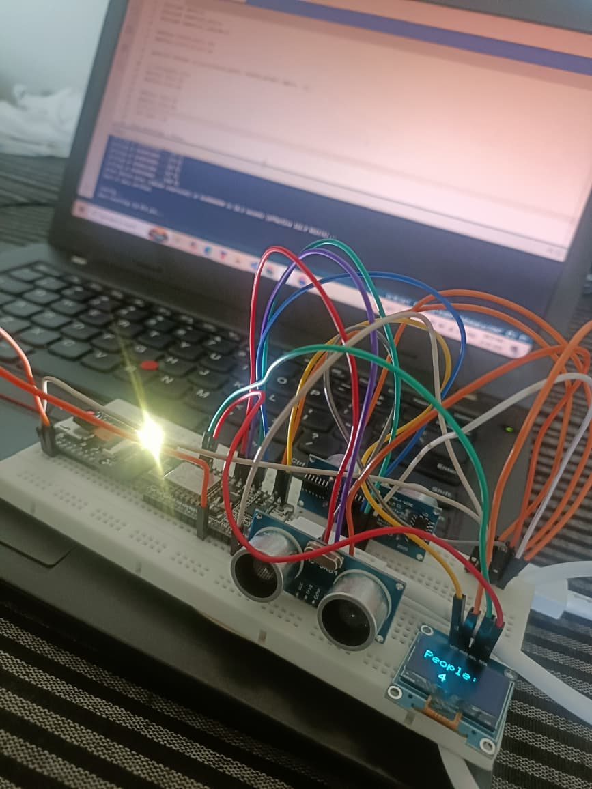
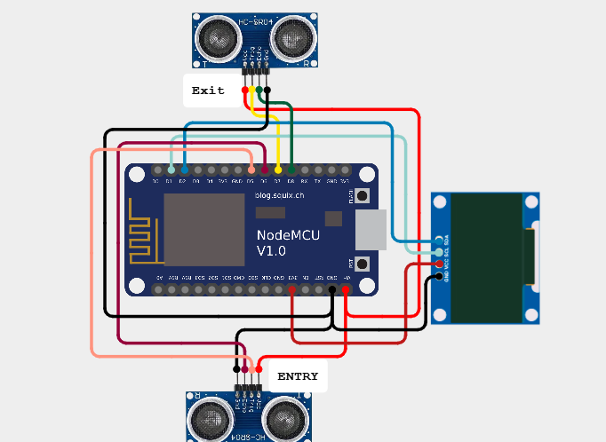
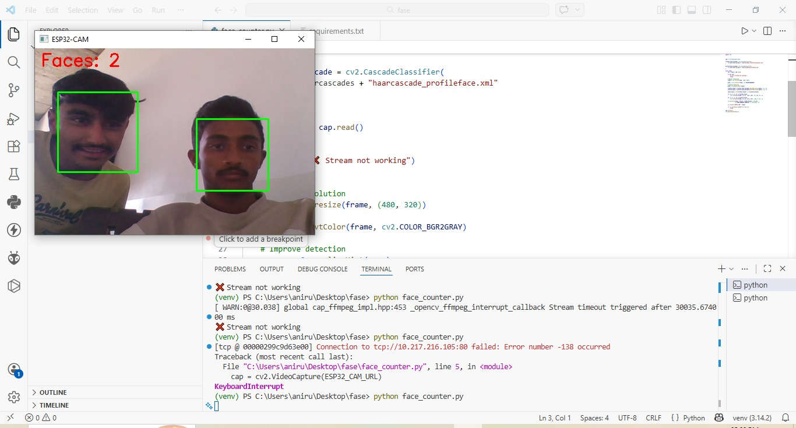

<h1 align="center">Smart Bus Passenger Counting System using ESP32-CAM IoT</h1>

<p align="center">
  <b>IoT + AI Powered Real-Time Passenger Monitoring System</b>
</p>

<p align="center">
  
  
  
  
</p>

<p align="center">
  
  
  
</p>

---

## 🧠 Overview

The **Smart Bus Passenger Counting System** is a real-time IoT-based solution designed to monitor passenger occupancy inside buses using **sensor fusion and computer vision**.

### 🔹 This system combines:

* 📡 IoT-based entry/exit tracking
* 📷 Real-time video streaming
* 🧠 AI-based face detection
* 📊 Live data visualization

---

## ⚙️ System Architecture

```plaintext
Entry Sensor  → Count++
Exit Sensor   → Count--

ESP32-CAM → WiFi → Python (OpenCV)

NodeMCU → OLED → Display Count
```

---

## 🔥 Core Features

* 🚍 Real-time passenger counting
* 📷 Live video monitoring (ESP32-CAM)
* 🧠 AI-based face detection (OpenCV)
* 🚶 Bidirectional entry/exit tracking
* 📊 OLED display output
* ⚡ Lightweight & cost-efficient

---

## 🛠️ Tech Stack

| Layer    | Technology            |
| -------- | --------------------- |
| Hardware | ESP32-CAM, NodeMCU    |
| Sensors  | Ultrasonic            |
| AI       | OpenCV (Haar Cascade) |
| Language | Python, Embedded C    |
| Network  | WiFi                  |

---

## 📸 Visuals

### 🔧 Hardware Setup

<p align="center">
  
</p>

### 🔌 Circuit Diagram

<p align="center">
  
</p>

### 📊 Output

<p align="center">
  
</p>

---

## ⚙️ Working Logic

1. Entry detected → Count increases
2. Exit detected → Count decreases
3. ESP32-CAM streams live video
4. Python processes frames using OpenCV
5. OLED displays passenger count

---

## ⚠️ Design Insight

> Ultrasonic sensors provide accurate counting, while camera detection is used for monitoring and verification.

---

---

## 🔌 Hardware Connections

### 📍 Ultrasonic Sensor 1 (ENTRY)

| Pin  | NodeMCU                     |
| ---- | --------------------------- |
| VCC  | Vin (5V)                    |
| GND  | GND                         |
| TRIG | D5                          |
| ECHO | D6 (via voltage divider ⚠️) |

---

### 📍 Ultrasonic Sensor 2 (EXIT)

| Pin  | NodeMCU                     |
| ---- | --------------------------- |
| VCC  | Vin (5V)                    |
| GND  | GND                         |
| TRIG | D7                          |
| ECHO | D8 (via voltage divider ⚠️) |

---

### 📍 OLED Display (I2C)

| Pin | NodeMCU |
| --- | ------- |
| VCC | 3.3V    |
| GND | GND     |
| SDA | D2      |
| SCL | D1      |

---

## ⚠️ Important Notes (Connections)

* ⚠️ **Ultrasonic ECHO pin gives 5V**, NodeMCU works on 3.3V → use **voltage divider**
* Ensure **common GND** for all components
* Use stable **5V power supply** for sensors
* Keep sensors aligned properly for accurate detection

---


## 💻 Setup & Installation

### 🔹 Clone Repository

```bash
git clone https://github.com/Anirudhdha068/Smart-Bus-Passenger-Counting-System-using-ESP32-CAM-IoT.git
cd Smart-Bus-Passenger-Counting-System-using-ESP32-CAM-IoT
```

---

## 🐍 Python Virtual Environment (Recommended)

### Create Virtual Environment

```bash
python -m venv venv
```

### Activate

**Windows**

```bash
venv\Scripts\activate
```

**Linux/Mac**

```bash
source venv/bin/activate
```

---

### Install Dependencies

```bash
pip install -r requirements.txt
```

---

### Run Python Script

```bash
python Python/face_detection.py
```

---

## 📁 Project Structure & Code Guide

```plaintext
ESP32-CAM/        → Camera streaming code  
NodeMCU/          → Passenger counting (Ultrasonic + OLED)  
Python/           → Face detection using OpenCV  
images/           → Project images  
videos/           → Demo video (optional)  
```

---

## ⚙️ Code Usage & Upload Guide

### 🔹 ESP32-CAM Code

📂 Location: ESP32-CAM/esp32_stream.ino

🛠️ Steps:

1. Open Arduino IDE
2. Install ESP32 board
3. Select **AI Thinker ESP32-CAM**
4. Enter WiFi credentials
5. Upload code

📡 Output:

* Open Serial Monitor
* Copy IP address
* Open in browser
  http://<ESP32_IP>

---

### 🔹 NodeMCU Code

📂 Location: NodeMCU/passenger_counter.ino

🛠️ Steps:

1. Open Arduino IDE
2. Select **NodeMCU 1.0 (ESP8266)**
3. Connect via USB
4. Upload code

📊 Output:

* OLED displays passenger count

---

### 🔹 Python Code

📂 Location: Python/face_detection.py

🛠️ Steps:

Install dependencies:

```bash
pip install -r requirements.txt
```

Update IP:

```python
ESP32_CAM_URL = "http://192.168.x.x/stream"
```

Run:

```bash
python Python/face_detection.py
```

📷 Output:

* Live camera feed with face detection

---

## 🔗 System Flow

* ESP32-CAM → streams video
* Python → detects faces
* Ultrasonic sensors → count passengers
* NodeMCU → updates OLED

---

## ⚠️ Important Notes

* Use same WiFi network for ESP32 and Laptop
* Ensure correct IP address in Python code
* Ultrasonic sensors must be placed properly
* Camera is for monitoring, sensors handle actual counting

---

## 📊 Output

* OLED → Passenger count
* Python → Detection window
* Browser → Live stream

---

## 🎥 Demo

Place demo video here:
videos/demo.mp4

---

## 🚀 Future Enhancements

* YOLO-based detection
* Cloud dashboard
* Mobile app
* GPS tracking

---

## 👨‍💻 Author

**Anirudhdha Poriya**
🚀 IoT Developer

---

## 🤝 Contributions

Contributions are welcome!
Feel free to fork and improve the project.

---

## ⭐ Support

If you like this project:

⭐ Star this repository
🔁 Share with others

---

## 📜 License

MIT License
